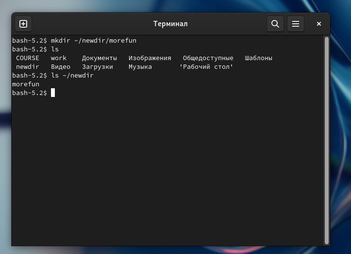
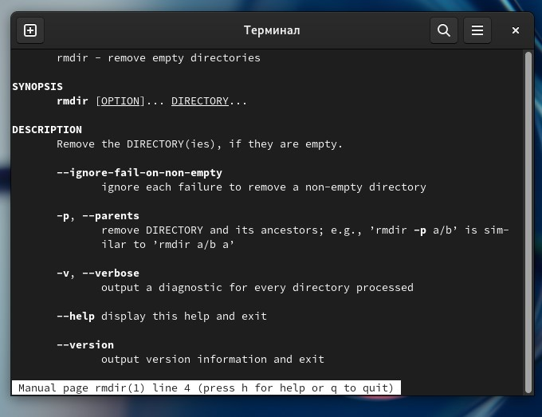

**Федеральное государственное автономное**

**Образовательное учреждение высшего образования**

**Российский Университет Дружбы Народов**

Математический университет имени Никольского

Факультет Физико-математических и Естественных наук

Кафедра Прикладной математики и информатики

Отчет по лабораторной работе № 4

“ Основы интерфейса взаимодействия

пользователя с системой Unix на уровне командной строки”

Выполнил:

Студент группы НПМбв-01-10

Сарновский Даниил Вячеславович

Москва

2024 год

Цель работы:
============

Приобретение практических навыков взаимодействия пользователя с системой
посредством командной строки.

Выполнение:
===========

1.  Определим полное имя вашего домашнего каталога. Далее относительно
    этого каталога будут выполняться последующие упражнения (Рис. 1).

{width="6.496527777777778in"
height="3.5397747156605424in"}

Рисунок 1. Полное имя домашнего каталога.

2\. Выполним следующие действия:

2.1. Перейдем в каталог /tmp (рис. 2.1).

{width="6.492181758530184in"
height="4.0368055555555555in"}

Рисунок 2.1. Переход в каталог /tmp.

2.2. Выведем на экран содержимое каталога /tmp. Для этого используем
команду ls с различными опциями (рис. 2.2, 2.3, 2.4).

{width="6.496527777777778in"
height="3.7729166666666667in"}

Рисунок 2.2. Использование команды ls -a.

{width="6.49594050743657in"
height="4.445138888888889in"}

Рисунок 2.3. Использование команды ls -l.

{width="6.496527777777778in"
height="4.315277777777778in"}

Рисунок 2.3. Использование команды ls -F.

2.3. Определим, есть ли в каталоге /var/spool подкаталог с именем cron
(рис. 2.4.):

{width="6.496527777777778in"
height="4.327083333333333in"}

Рисунок 2.4. Каталог /var/spool/.

2.4. Перейдем в наш домашний каталог и выведем на экран его содержимое
(рис. 2.5).

{width="6.496527777777778in"
height="4.570473534558181in"}

Рисунок 2.4. Переход на домашний каталог.

3\. Выполним следующие действия:

3.1. В домашнем каталоге создадим новый каталог с именем newdir (рис.
3.1):

{width="6.496527777777778in"
height="4.466362642169729in"}

Рисунок 3.1. Создание каталога newdir.

3.2. В каталоге \~/newdir создадим новый каталог с именем morefun (рис.
3.2).

{width="6.496527777777778in"
height="4.706944444444445in"}

Рисунок 3.2. Создание каталога morefun.

3.3. В домашнем каталоге создадим одной командой три новых каталога с
именами letters, memos, misk. Затем удалим эти каталоги одной командой
(рис 3.3).

{width="6.496527777777778in"
height="4.597222222222222in"}

Рисунок 3.3. Создание каталогов memos, letters, misk.

{width="6.496527777777778in"
height="4.366666666666666in"}

Рисунок 3.3. Удаление каталогов memos, letters, misk.

3.4. Попробуем удалить ранее созданный каталог \~/newdir командой rm.
Проверим, был ли каталог удалён (рис. 3.4).

{width="6.496527777777778in"
height="4.882806211723534in"}

Рисунок 3.4. Удаление каталога newdir.

3.5. Удалим каталог \~/newdir/morefun из домашнего каталога. Проверим,
был ли каталог удалён (рис. 3.5).

{width="6.496527777777778in"
height="4.861111111111111in"}

Рисунок 3.4. Удаление каталога \~/newdir/morefun из домашнего каталога.

4\. С помощью команды man определите, какую опцию команды ls нужно
использовать для просмотра содержимое не только указанного каталога, но
и подкаталогов, входящих в него (рис. 4.1, 4.2, 4.3, 4.4).

{width="6.496527777777778in"
height="4.759722222222222in"}

Рисунок 4.1. ls – информация.

{width="6.496527777777778in"
height="5.092361111111111in"}

Рисунок. 4.2. ls-информация (продолжение).

{width="6.496527777777778in"
height="4.8597222222222225in"}

Рисунок. 4.3. ls-информация (продолжение).

{width="6.496527777777778in"
height="4.863194444444445in"}

Рисунок. 4.4. ls-информация (продолжение).

5\. С помощью команды man определите набор опций команды ls, позволяющий
отсортировать по времени последнего изменения выводимый список
содержимого каталога с развёрнутым описанием файлов (рис. 5).

{width="6.493273184601925in"
height="4.6930555555555555in"}

Рисунок 5. Выполнение команды.

6\. Используйте команду man для просмотра описания следующих команд: cd,
pwd, mkdir, rmdir, rm. Поясните основные опции этих команд (рис. 6.1,
6.2, 6.3, 6.4, 6.5).

{width="6.496527777777778in"
height="4.602083333333334in"}

Рисунок 6.1. Использование команды для cd.

{width="6.496527777777778in"
height="4.433333333333334in"}

Рисунок 6.2. Использование команды для pwd.

{width="6.496527777777778in"
height="4.577083333333333in"}

Рисунок 6.3. Использование команды для mkdir.

{width="6.496527777777778in" height="4.35in"}

Рисунок 6.4. Использование команды для rm.

{width="6.496527777777778in"
height="4.998611111111111in"}

Рисунок 6.5. Использование команды для rmdir.

7\. Используя информацию, полученную при помощи команды history, выполним
модификацию и исполнение нескольких команд из буфера команд (рис. 7.1,
7.2).

{width="6.496527777777778in"
height="4.91403980752406in"}

Рисунок 7.1. Использование команды history.

{width="6.496527777777778in"
height="4.611111111111111in"}

Рисунок 7.2. Использование команды 23.

Вывод:
======

Были приобретение практические навыки взаимодействия пользователя с
системой посредством командной строки.

Ответы на контрольные вопросы:
==============================

1.  Что такое командная строка?

Командная строка - это текстовый интерфейс для взаимодействия между
пользователем и компьютером, в котором пользователь дает компьютеру
определенные инструкции, вводя их с клавиатуры. Интерфейс командной
строки отличается от управления на основе меню и графического интерфейса
пользователя.

1.  При помощи какой команды можно определить абсолютный путь текущего
    каталога? Приведите пример.

Команда pwd может использоваться для определения абсолютного пути к
текущему каталогу. Например, чтобы найти абсолютный путь к каталогу, в
котором вы находитесь в данный момент, вам следует ввести pwd в
командной строке: /home/dvarsnovskij.

1.  При помощи какой команды и каких опций можно определить только тип
    файлов

и их имена в текущем каталоге? Приведите примеры.

Команда ls -F может быть использована для отображения типов файлов и их
имен в текущем каталоге. Например:

-&gt; `ls`` -F`

bin/ Видео/ Изображения/ Общедоступные/

work/ Документы/ КомпАл/ ‘Рабочий стол’/

‘Библиотека calibre’/ Загрузки/ Музыка/ Шаблоны/

1.  Каким образом отобразить информацию о скрытых файлах?
    Приведите примеры.

Команда ls -a может быть использована для отображения информации о
скрытых файлах. Например:

. .clamtk .local Video

.. .config .mozilla Documents

.asy .dotnet .pki Downloads

.atom .FBReader .profile Images

.bash\_history .gitconfig .sage CompAl

.bash\_logout .gnupg .ssh Music

.bash\_profile .ipynb\_checkpoints .texlive2021 Public

.bash\_profile.bak .ipython .vscode 'Desktop'

.bashrc .java .wget-hsts Templates

bin .jmol work

.cache .jupyter .yandex

1.  При помощи каких команд можно удалить файл и каталог? Можно ли это
    сделать

одной и той же командой? Приведите примеры.

Для удаления файла можно использовать команду rm. Для удаления пустого
каталога можно использовать команду rmdir. Для удаления непустого
каталога можно использовать команду rm -r.

1.  Каким образом можно вывести информацию о последних выполненных
    пользователем командах? работы?

> Команда "history" может использоваться для отображения информации о
> последних командах, выполненных пользователем.

1.  Как воспользоваться историей команд для их модифицированного
    выполнения? Приведите примеры.

> `Чтобы выполнить измененную команду из истории, вы можете использовать следующий синтаксис``: !``<номер команды>:s/<что изменить>/<на что изменить>.`

1.  Приведите примеры запуска нескольких команд в одной строке.

В одной строке можно выполнить несколько команд, разделив их точкой с
запятой (;).

1.  Дайте определение и приведите примера символов экранирования.

Экранирующие символы используются для указания на то, что специальный
символ (например, ".", "/", "\*", и т.д.) следует рассматривать как
буквальный символ, а не как специальную команду или шаблон. Обычно они
добавляются перед такими символами, когда контекст требует рассматривать
их как обычный текст, а не как команды.

1.  Охарактеризуйте вывод информации на экран после выполнения команды
    ls с опцией l.

Команда ls -l отображает подробную информацию о каждом файле и каталоге,
включая тип файла, права доступа, количество ссылок, владельца, размер,
дату изменения и имя файла/каталога.

1.  Что такое относительный путь к файлу? Приведите примеры
    использования относительного и абсолютного пути при выполнении
    какой-либо команды.

> Относительный путь указывает на расположение файла или каталога
> относительно текущего каталога. Например, если вы находитесь в
> каталоге отчетов и в нем есть подкаталог images, вы можете получить к
> нему доступ, используя относительный путь images. С другой стороны,
> абсолютный путь указывает полный путь от корневого каталога, такого
> как /home/dvarsnovskij/Videos.

1.  Как получить информацию об интересующей вас команде?

> Вы можете использовать команду help или команду man для получения
> информации о конкретной команде.

1.  Какая клавиша или комбинация клавиш служит для автоматического
    дополнения вводимых команд?

Клавиша Tab используется для автоматического завершения введенных
команд.
